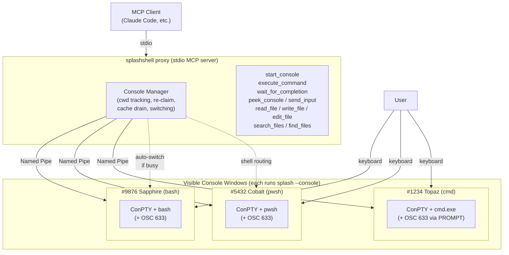

# splashshell

<div align="center">
  
</div>

A universal MCP server that gives AI assistants a **real, visible terminal** — the same one you're looking at. Run any shell (bash, pwsh, cmd), see every command the AI executes, type into the same console yourself, and keep session state alive across calls.

## Why splashshell?

Most shell MCP servers fall into one of two buckets: **stateless** (each command runs in an isolated subprocess — nothing persists) or **headless** (the AI has a persistent PTY, but you can't see it or type into it). splashshell is neither.

### You and AI share the same terminal

splashshell opens a **real, visible terminal window**. When the AI runs a command, you see it happen in real time — the same characters, the same output, the same prompt. You can type into the same terminal at any time. The AI can see what you typed via `peek_console`. This isn't a web dashboard or a log viewer — it's the actual terminal.

Most shell MCP servers use a headless PTY that the user can't see. splashshell takes the opposite approach: full transparency, full control, no external dependencies.

### The AI can see the screen and respond to it

When a command times out or gets stuck, the AI isn't blind:

1. **`execute_command` times out** → response includes a `partialOutput` snapshot of the screen
2. **`peek_console`** → read-only snapshot of what the terminal is currently displaying (on Windows: exact screen buffer read via native API)
3. **`send_input`** → send keystrokes to the running command: Enter for prompts, Ctrl+C to interrupt, arrow keys for TUI navigation

This means the AI can diagnose and respond to interactive prompts (`Read-Host`, password dialogs, `y/n` confirmations), exit watch-mode processes, or kill stuck commands — without human intervention.

### Session state persists — and that matters most for PowerShell

All shells benefit from persistent sessions (environment variables, command history, working directory). But for **PowerShell, session persistence is critical**:

- **Module import cost**: A cold `Import-Module Az.Compute, Az.Storage` takes **30–70 seconds**. With splashshell, the AI imports once and every subsequent cmdlet call returns in under a second
- **Object pipeline**: PowerShell passes .NET objects, not text. `$issues = gh issue list ... | ConvertFrom-Json` stores a rich object — filter it, transform it, join it across commands. In an isolated subprocess, that object vanishes after each call
- **10,000+ modules on [PowerShell Gallery](https://www.powershellgallery.com/)**: Az, AWS.Tools, Microsoft.Graph, ExchangeOnlineManagement, PnP.PowerShell — plus any CLI tool (git, docker, kubectl, terraform, gh)

```powershell
# Command 1: one-time cold import (30–70 seconds)
Import-Module Az.Compute, Az.Storage

# Command 2 (instant — module already loaded)
Get-AzVM -Status | Where-Object PowerState -eq "VM running" |
    Select-Object Name, @{N='Size';E={$_.HardwareProfile.VmSize}}, Location

# Command 3 (instant — session is still alive)
Get-AzStorageAccount | Select-Object StorageAccountName, Location, Kind
```

### Structured command lifecycle

splashshell injects [OSC 633 shell integration](https://code.visualstudio.com/docs/terminal/shell-integration) scripts (the same protocol VS Code uses) into every shell it starts. This gives it reliable, marker-based detection of:
- When a command starts and finishes (not heuristic — explicit markers)
- The exit code
- The current working directory after each command
- Whether the console is busy with a user-typed command

Other MCP servers rely on output-silence heuristics (`waitForIdle`) or prompt-string detection, which break on slow commands, multi-line output, or non-standard prompts.

## More features

- **Multiple shells side by side.** bash, pwsh, cmd, and others can all be active at the same time. Switch between them per command.
- **Console re-claim.** Consoles outlive their parent MCP process. When the AI client restarts, the next session reattaches to existing consoles — modules stay loaded, variables survive.
- **Auto cwd handoff.** When a same-shell console is busy, a new one is auto-started in the source console's directory and your command runs immediately — no manual `cd` needed.
- **Cwd drift detection.** If you manually `cd` in the terminal, the AI is warned before its next command — no silent execution in the wrong directory.
- **Multi-line PowerShell.** heredocs, foreach, try/catch, nested scriptblocks — handled via tempfile dot-sourcing. Session state persists, history stays clean.
- **Sub-agent isolation.** Allocate per-agent consoles with `is_subagent` + `agent_id` so parallel agents don't clobber each other's shells.

## Architecture



## Install

No global install is required — `npx` fetches and runs splashshell on demand. The only prerequisite is the [.NET 9 Desktop Runtime](https://dotnet.microsoft.com/download/dotnet/9.0) (the package bundles a ~5.6 MB native `splash.exe` that needs it).

> The `@latest` tag is important: without it, npx will happily keep reusing a stale cached copy even after a new version ships.

### Claude Code

```bash
claude mcp add-json splash -s user '{"command":"npx","args":["-y","splashshell@latest"]}'
```

### Claude Desktop

Add to `%APPDATA%\Claude\claude_desktop_config.json`:

```json
{
  "mcpServers": {
    "splash": {
      "command": "npx",
      "args": ["-y", "splashshell@latest"]
    }
  }
}
```

### Build from source (for development)

```bash
git clone https://github.com/yotsuda/splashshell.git
cd splashshell
dotnet publish -c Release -r win-x64 --no-self-contained -o ./dist
```

The binary is `./dist/splash.exe`. Use the absolute path instead of the `npx` command in your MCP config.

## Tools

### Shell tools

| Tool | Description |
|------|-------------|
| `start_console` | Open a visible terminal window. Pick a shell (bash, pwsh, powershell, cmd, or a full path). Optional `cwd`, `banner`, and `reason` parameters. Reuses an existing standby of the same shell unless `reason` is provided. |
| `execute_command` | Run a pipeline. Optionally specify `shell` to target a specific shell type — finds an existing console of that shell, or auto-starts one. Times out cleanly with output cached for `wait_for_completion`. On timeout, includes a `partialOutput` snapshot so the AI can diagnose stuck commands immediately. |
| `wait_for_completion` | Block until busy consoles finish and retrieve cached output (use after a command times out). |
| `peek_console` | Read-only snapshot of what a console is currently displaying. On Windows, reads the console screen buffer directly (exact match with the visible terminal). On Linux/macOS, uses a built-in VT terminal interpreter as fallback. Specify a console by display name or PID, or omit to peek at the active console. Reports busy/idle state, running command, and elapsed time. |
| `send_input` | Send raw keystrokes to a **busy** console's PTY input. Use `\r` for Enter, `\x03` for Ctrl+C, `\x1b[A` for arrow up, etc. Rejected when the console is idle (use `execute_command` instead). Console must be specified explicitly — no implicit routing, for safety. Max 256 chars per call. |

Status lines include the console name, shell family, exit code, duration, and current directory:

```
✓ #12345 Sapphire (bash) | Status: Completed | Pipeline: ls /tmp | Duration: 0.6s | Location: /tmp
```

**Busy console workflow:** When `execute_command` times out, the response includes a `partialOutput` snapshot of what the console is currently displaying, so the AI can diagnose the situation immediately — watch mode, interactive prompt, stalled progress. From there:
- `send_input` to respond (Enter, Ctrl+C, y/n) or interrupt, or
- `wait_for_completion` to wait for the natural finish, or
- `peek_console` to get a fresher snapshot if more time has passed since the timeout.

Each MCP tool call also drains:

- **Cached results** from any console whose timed-out command has since finished
- **Closed console notifications** when a console window has been closed since the last call

### File tools

Claude Code–compatible file primitives, useful when the MCP client doesn't already provide them.

| Tool | Description |
|------|-------------|
| `read_file` | Read a file with line numbers. Supports `offset` / `limit` for paging through large files. Detects binary files. |
| `write_file` | Create or overwrite a file. Creates parent directories as needed. |
| `edit_file` | Replace an exact string in a file. Old string must be unique by default; pass `replace_all` to replace every occurrence. |
| `search_files` | Search file contents with a regular expression. Returns matching lines with file paths and line numbers. Supports `glob` filtering. |
| `find_files` | Find files by glob pattern (e.g., `**/*.cs`). Returns matching paths. |

## Multi-shell behavior

splashshell tracks the cwd of every console and can switch transparently between same-shell consoles:

| Scenario | Behavior |
|---|---|
| First execute on a new shell | Auto-starts a console; warns so you can verify cwd before re-executing |
| Active console matches requested shell | Runs immediately |
| Active console busy, same shell requested | Auto-starts a sibling console **at the source console's cwd** and runs immediately |
| Switch to a same-shell standby | Prepends `cd` preamble so the command runs in the source cwd, then executes |
| Switch to a different shell | Warns to confirm cwd (cross-shell path translation is not implemented) |
| User manually `cd`'d in the active console | Warns so the AI can verify the new cwd before running its next command |

Window titles use the format `#PID Name` (e.g., `#12345 Sapphire`) so you can identify each console at a glance. When the parent MCP process exits, titles change to `#PID ~~~~` to indicate the console is up for re-claim.

## Platform support

- **Windows**: ConPTY + Named Pipe (primary target, fully tested)
- **Linux/macOS**: Unix PTY fallback (experimental)

## How it works

splashshell runs as a stdio MCP server. When the AI calls `start_console`, splashshell spawns itself in `--console` mode as a ConPTY worker, which hosts the actual shell (cmd.exe, pwsh.exe, bash.exe, etc.) inside a real Windows console window. The parent process streams stdin/stdout over a named pipe, injects shell integration scripts (`ShellIntegration/integration.*`) to emit OSC 633 markers, and parses those markers to delimit command output, track cwd, and capture exit codes.

Result: the AI gets structured command-by-command output, the user gets a real terminal they can type into, and session state (cwd, env, history) persists across every call.

## License

MIT
